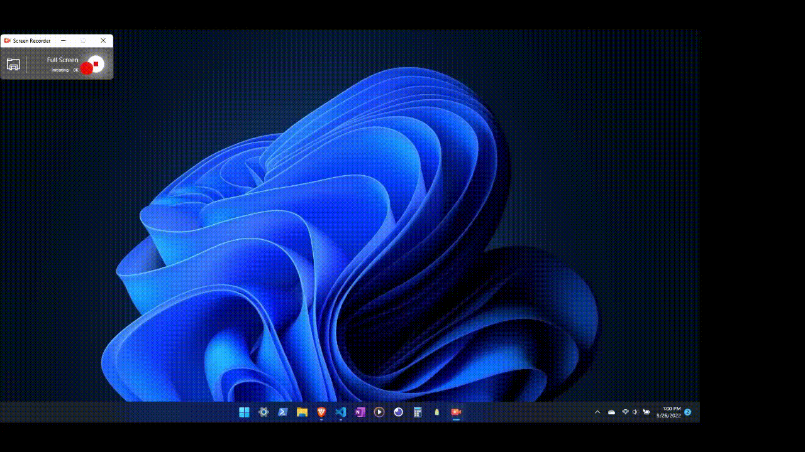

<h1 align="center">The Shopping List App</h1>

I built a full-stack progressive web app [PWA](https://www.google.com/search?q=what+is+a+PWA) that allows for everyone who has the app to view one centralised list and make edits(Add or Remove items) to one list, for example one shopping list🛍️ for a whole family👨‍👩‍👧‍👦. I developed this app using Python🐍 for both the front-end and the back-end. I used [Pyscript](https://pyscript.net/)(for the user interface) and [flask](https://en.wikipedia.org/wiki/Flask_(web_framework))(for the backend). Most people build PWA's using Javascript, as javascript is the main language of the WEB, however I like to challenge myself so I decided to build this PWA using 99% Python code.

<h2 align="center">

Demo:

</h2>

 

<h2 align="center">

Description(The **How** and **Why**):

</h2>

<h2 align="center">
Features:
</h2>

- ➕Add items

- 🗑️Remove Items
- 🧮Calculate the cost of all the items
- 💾Save Shopping List offline
  - ➕Automatically add any offline changes to the centralised shopping list when back online
- Automatically add the appropriate emoji to a given item
